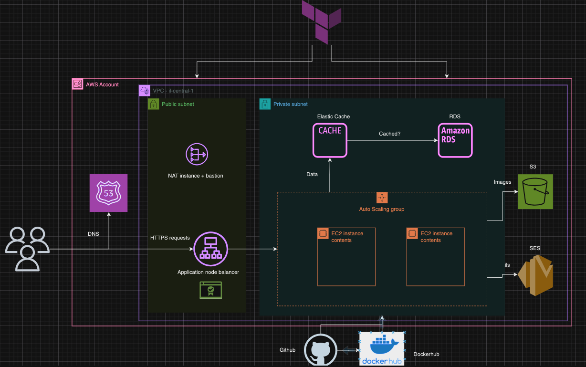
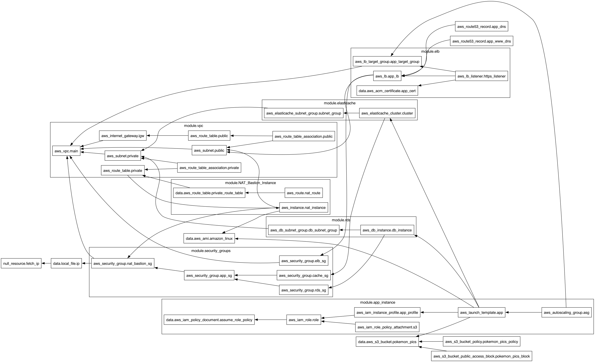

# Pokémon Card Store Web App

A modern web application for managing and showcasing Pokémon cards with advanced search, user roles, and cloud deployment.

## Features
- **Browse Cards**: View Pokémon cards with images, names, prices, and other details.
- **Advanced Search**: Search by Pokémon name, filter by set name, sort by price, or card number.
- **Authentication**:
  - User registration and login/logout functionality.
  - **User Roles**:
    - **Normal Users**: Add cards to their cart and view available cards.
    - **Uploaders**: Upload new cards.
    - **Admins**: Access all features, manage users, and upload cards.
- **Admin Panel**:
  - Promote users to "Uploader" role.
  - Manage all user accounts.
  - Reset all cards, including deleting card images from S3.
- **Cloud Integration**:
  - Image uploads stored securely in AWS S3.
  - PostgreSQL hosted on AWS RDS.
- **Modal Views**: View full card details and images in an enlarged modal.

## Technologies
- **Backend**: Flask, Flask-SQLAlchemy, Flask-Migrate, Flask-Login, Flask-Caching.
- **Database**: PostgreSQL (via AWS RDS).
- **Cloud Services**: AWS S3 for image storage, AWS RDS for database and Elastic cache.
- **Frontend**: Bootstrap 5.
- **DevOps**: Docker, Terraform, Github Actions.

## Admin Operations
- **Admin Panel**: Accessible at `/admin/users`.
- **Promote Users**: Change roles from "Normal" to "Uploader".
- **Reset Cards**: Removes all cards from the database and deletes images from S3.

## Infrastructure Diagram

## Terraform Graph

*This diagram was generated using Draw.io and provides an overview of the application's cloud-based architecture.*

## Environment Variables
- **General**:
  - `SECRET_KEY`: Flask app secret key.
- **Database**:
  - `DB_USERNAME`, `DB_PASSWORD`, `DB_HOST`, `DB_NAME`: PostgreSQL credentials.
- **AWS Integration**:
  - `AWS_ACCESS_KEY_ID`, `AWS_SECRET_ACCESS_KEY`: Credentials for AWS.
  - `AWS_REGION`: AWS region for S3.
  - `S3_BUCKET`: Name of the S3 bucket.

## Future Enhancements
- Add test coverage with unit and integration tests.
- Improve logging and monitoring for cloud services.
- Work on piepline

